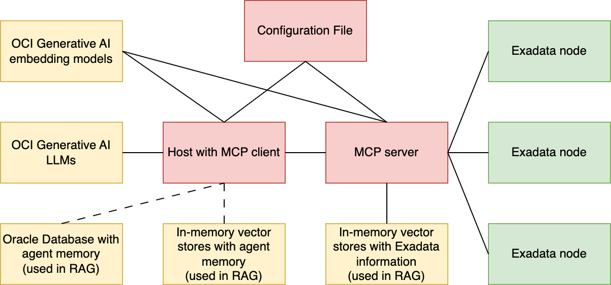
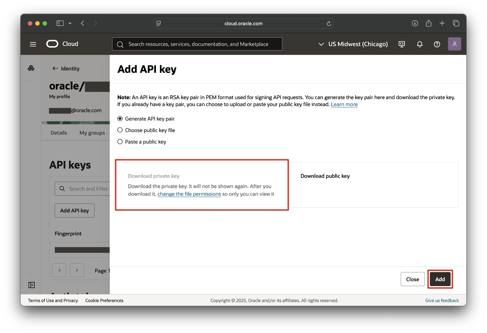

# ExaCopilot

You can also [view this document in Confluence](https://confluence.oraclecorp.com/confluence/display/EXD/ExaCopilot).

You can access the latest version of ExaCopilot on the node scaqat20adm07 in the directory `~/exacopilot`. See [Usage](#usage) for details on how to run, or copy `exacopilot.zip` to your local machine and see [Setup](#setup) for details on how to set up.

## Overview

ExaCopilot is an agentic AI system designed to assist with Exadata administration and decision making. It can be run locally and consists of a client and a server that are compliant with the [Model Context Protocol (MCP)](https://modelcontextprotocol.io/) by Anthropic. ExaCopilot connects to OCI Generative AI LLMs and an Oracle Database on the client side and interacts with the nodes in an Exadata fleet on the server side. See [more information about MCP for Exadata](https://confluence.oraclecorp.com/confluence/display/EXD/Model+Context+Protocol+%28MCP%29+for+Exadata+Systems).



ExaCopilot provides the following benefits:

- AI reasoning helps with decision making and debugging, increases efficiency of day-to-day workflows, and reduces operational costs.
- Offloading reasoning to LLMs hosted in OCI prevents resources from being consumed on Exadata nodes.
- Executing tools from natural-language queries eliminates the need to remember CellCLI/dbmcli syntax.

Client-side features include:

- Chat interface: ExaCopilot prompts the user to submit requests or queries regarding Exadata through a chat interface, enabling the user to interact with the fleet using natural language.
- Agentic AI capabilities: ExaCopilot responds to requests through agentic workflows that involve iteratively consulting LLMs and automatically leveraging the appropriate tools.
- Short-term and long-term memory: Short-term memory preserves immediate session context, while long-term memory preserves actions and user-provided ideas saved over time.
- Node polling (optional): By accessing modifiable node attributes `questionForLlm` and `answerFromLlm`, ExaCopilot can periodically poll the nodes in the Exadata fleet for questions and provide answers.
- Oracle Database access (optional): ExaCopilot can store long-term memory in an Oracle Database. By default, long-term memory is saved to the local machine.

Server-side features include:

- MCP tools: ExaCopilot has access to tools for administering and debugging the Exadata system and may utilize them in response to user and system requests.
- MCP sampling: Some tools involve MCP sampling of OCI LLMs on the client side to enhance tool execution with LLM reasoning.
- Retrieval augmented generation (RAG): Some tools draw from external sources of Exadata-related knowledge (e.g., help documents, metric descriptions, object attribute lists) to supplement tool execution.

Additional features include:

- Configurability: A configuration file with OCI Generative AI, Oracle Database, and Exadata fleet parameters allows the user to customize ExaCopilot for their system.
- Flexibility: Any MCP client supporting MCP tools and MCP sampling can interface with an Exadata system through the Exadata MCP server.
- Security: In order to run ExaCopilot on a given machine, SSH equivalence must first be established to allow the machine to access all nodes in the fleet. In order to store long-term memory in an Oracle Database, credentials must be stored in an Oracle Wallet. No passwords are exposed in the `config.ini` file.
- Time awareness: ExaCopilot recognizes the user's time zone and the current time in order to properly handle requests that reference specific time points.

## Setup

### Oracle Cloud Infrastructure (OCI) Generative AI configuration

The following setup steps were adapted from [these instructions](https://confluence.oraclecorp.com/confluence/display/DASP/OraHub+and+OCI+Initial+Setup+-+Database+Developer).

Go to [OIM](https://oim.oraclecorp.com) and request access to the entitlement `DATABASEDEV GENAI_SHARED`.

Go to [Oracle Cloud](https://cloud.oracle.com). In the *Cloud Account Name* field, enter `oracle`. Click *Next*.


Click *Change tenancy*.


Enter `databasedev` in the *Tenancy* field. Click *Continue*.


Click *Sign in with an identity provider* and enter `oracle`. Click *Next*.


Proceed to sign in to Oracle. After signing in, set the region to `US Midwest (Chicago)`.


Go to the [Identity & Security page](https://cloud.oracle.com/identity/domains/my-profile/auth-tokens). Click *Add API key*.


With *Generate API key pair* selected, click *Download private key* to download your private key. Then, click *Add*.



Click *Copy* to copy the contents of your configuration file.


On your local machine, create the folder `$HOME/.oci` if it does not already exist. Create a file `$HOME/.oci/config` and paste the copied contents into this file. Move your recently downloaded private key file (a `.pem` file) into `$HOME/.oci`. Edit `$HOME/.oci/config` by putting the path to your private key file in the `key_file` field.

```bash
cd $HOME
mkdir -p .oci
cp <path to your private key> $HOME/.oci
touch .oci/config
# Open the config file in your preferred editor
$EDITOR .oci/config
# Copy config contents to file and edit key_file field
```

### ExaCopilot OCI configuration

Fill in the fields in `config.ini` under `[OCI]` as follows:

- `chat_model_id`: The OCI chat model used for agentic reasoning. `cohere.command-a-03-2025` is given by default, as it is the latest OCI chat model that supports LangChain tool calling.
- `embed_model_id`: The OCI embed model used for RAG embeddings. `cohere.embed-v4.0` is given by default, as it is the latest OCI embed model.
- `sampling_model_id`: The OCI chat model used for MCP sampling. `xai.grok-3-fast` is given by default, as it is one of the latest and fastest OCI chat models. (`xai.grok-3-fast` does not support LangChain tool calling, so we do not use it for agentic reasoning.)
- `service_endpoint`: The service endpoint for the OCI models. The `US Midwest (Chicago)` endpoint is given by default, as it has extensive model support.
- `compartment_id`: The compartment ID for OCI model access. The compartment ID for the `databasedev` tenancy used in the example code on the [Generative AI playground](https://cloud.oracle.com/ai-service/generative-ai/playground/) is given by default.

For more customization, go to the [Generative AI playground](https://cloud.oracle.com/ai-service/generative-ai/playground/). In the *Compartment* dropdown, choose `GenAI_Shared` (located under `databasedev (root)/DevGroups/Genai_Shared`). You can toggle between the *Chat* and *Embedding* tabs to see the available chat and embed models. You can select a model using the *Model* dropdown and get the ID by clicking *View model details*.


### ExaCopilot system configuration

First, [establish SSH user equivalence](https://docs.oracle.com/en/engineered-systems/exadata-database-machine/sagug/using-dcli-set-user-equivalence-current-user.html) for a user in your Exadata system.

Fill in the fields in `config.ini` under `[SYSTEM]` as follows:

- `username`: The name you'd like ExaCopilot to call you.
- `tz_identifier`: The identifier for your time zone. See [TZ identifiers](https://en.wikipedia.org/wiki/List_of_tz_database_time_zones#List).
- `db_nodes`: A comma-separated list of the database servers in your fleet.
- `cell_nodes`: A comma-separated list of the cell servers in your fleet.
- `dcli_path`: The path to the `dcli.py` script on your local machine. Make sure this script is a Python script ending in `.py`. `dcli.py` in the `exacopilot` directory is given by default.
- `exadata_qa_path` (optional): The path to a Q&A file where ExaCopilot should write questions from Exadata and their corresponding LLM-generated answers if polling is enabled. `exadata_qa.txt` in the `exacopilot` directory is given by default.

### ExaCopilot database configuration (optional)

You can optionally configure ExaCopilot to store long-term memory in an Oracle Database.

First, make sure you have Oracle Client installed. You can install Oracle Instant Client for [macOS](https://www.oracle.com/database/technologies/instant-client/macos-arm64-downloads.html), [Windows](https://www.oracle.com/database/technologies/instant-client/winx64-64-downloads.html), or [Linux](https://www.oracle.com/database/technologies/instant-client/linux-x86-64-downloads.html). On Linux, set the `LD_LIBRARY_PATH` environment variable to your Oracle Client library path.

[Set up Oracle Wallet](https://python-oracledb.readthedocs.io/en/latest/user_guide/connection_handling.html#using-an-oracle-wallet-for-external-authentication) to store your Oracle Database username and password. This involves editing `~/.sqlnet.ora` to include the full path to your wallet.

Then, fill in the fields in `config.ini` under `[DB]` as follows:

- `connection_string`: Your database connection string.
- `wallet_path`: The path to the wallet storing your database username and password.
- `client_library_path` (for macOS and Windows systems only): The path to your Oracle Client library directory.

### Example ExaCopilot configuration

Your `config.ini` should look something like this.

```
[OCI]
chat_model_id=cohere.command-a-03-2025
embed_model_id=cohere.embed-v4.0
sampling_model_id-xai.grok-3-fast
service_endpoint=https://inference.generativeai.us-chicago-1.oci.oraclecloud.com
compartment_id=ocid1.compartment.oc1..aaaaaaaa47jbpgerlzz4fdgpqrbelelkj7mamirdqdbwdrtkm3ez6b7mnizq
[SYSTEM]
username=Joy
tz_identifier=America/Los_Angeles
db_nodes=scaqat20adm07,scaqat22adm07
cell_nodes=scaqat20celadm10,scaqat20celadm11,scaqat22celadm10
dcli_path=dcli.py
exadata_qa_path=exadata_qa.txt
[DB]
connection_string=scaqan08adm05vm04.us.oracle.com:1521/exalmtest:dedicated
wallet_path=wallet
client_library_path=/opt/oracle/instantclient_23_3
```

### Installation

Make sure you are disconnected from VPN for package installation and your Python version is Python 3.11 or later. Then, run the following commands while in the `exacopilot` directory. 

```bash
python3 -m venv .venv
source .venv/bin/activate
pip install -r requirements.txt
```

## Usage

Make sure you are connected to VPN and in the `exacopilot` directory.

Run `./exacopilot.sh` to run ExaCopilot in default mode. In the terminal after the `You:` prompt, you can enter a query or `quit` to terminate.

Run with `--verbose` or `-v` to run with verbose output. You can see the steps taken by the chat agent including tool calls.

Run with `--poll` or `-p` to add polling (if supported by the fleet), which runs in parallel with the interactive chat. Periodically, ExaCopilot "pings" each node in the fleet for a query by extracting the value of the `questionForLlm` attribute. ExaCopilot generates a response to the query, possibly executing tools in the process, and sets the `answerFromLlm` attribute on the node to the response. Each query-response pair is also added to the Exadata Q&A file specified in `config.ini`. Setting `questionForLlm` to a new value clears the value of `answerFromLlm`.

Run with `--database` or `-d` to connect to an Oracle Database for long-term memory storage. This requires filling in the fields in `config.ini` under `[DB]`. Episodic memory is stored in a table called `exacopilot_episodic_memory`, while semantic memory is stored in a table called `exacopilot_semantic_memory`.

Run with `--read-only` or `-r` to use a version of the Exadata MCP server with read-only tools. This prevents ExaCopilot from modifying the fleet.

### Querying ExaCopilot

Ask questions about your system or request specific actions. You can prompt ExaCopilot to execute tools on specific nodes, all nodes, all cell nodes, or all database nodes. See the tables below for summaries of the tools I've implemented so far.

#### Generalizable tools (utilizing retrieval-augmented generation (RAG) and sampling)

RAG tools provide a great deal of flexibility, as they involve drawing knowledge from external data sources (e.g., help documents, metric descriptions, object attribute lists) to supplement tool execution.

| Tool | Description | Sample query |
| - | - | - |
| `execute_dbmcli_cmd` | Execute a command given a natural-language request using dbmcli on a set of database nodes. | "Use dbmcli to list the LUNs on my database nodes." |
| `execute_cellcli_cmd` | Execute a command given a natural-language request using CellCLI on a set of cell nodes. | "Create a new user called Ryan with password HelloWorld1 on scaqat22celadm10." |
| `get_current_metric` | Get the current value of a specific metric for a set of nodes given the name or description of the metric. | "What is the CPU utilization for all of my nodes?" |

#### Informational tools

| Tool | Description | Sample query |
| - | - | - |
| `get_node_info` | Get general information for a set of nodes. | "Tell me about the nodes in my fleet. What is the make of each database node in my fleet?" |
| `get_cell_disk_info` | Get cell disk information for a set of cell nodes. | "Tell me about the cell disks on scaqat20celadm10." |
| `get_physical_disk_info` | Get physical disk information for a set of nodes. | "What are the physical disks on scaqat20adm07 and scaqat22celadm10?" |

#### Debugging tools

| Tool | Description | Sample query |
| - | - | - |
| `get_alert_history` | Get alert history for a set of nodes. | "Did anything unusual occur on my cell nodes yesterday?" |
| `get_system_messages` | Get system messages logged in `/var/log/messages` on each node in a set of nodes over a given time range. | "Are there any messages in /var/log/messages from 10 PM last night on scaqat20adm07?" |
| `get_alert_log` | Get alert log messages logged in `alert.log` and `log.xml` relating to Exascale services, cell services, or database services on each node in a set of nodes over a given time range. | "Are there any Exascale alert.log messages from July 14 on scaqat20adm07?" |
| `hangman` | Determine the cause of a CELLSRV hang based on an incident number. | "Can you determine the root cause of the most recent CELLSRV hang in the alert history?" |

#### Administrative tools

| Tool | Description | Sample query |
| - | - | - |
| `alter_software_update_frequency` | Change software update frequency for a set of nodes. | "Perform weekly software updates on my database nodes." |
| `alter_node_services` | Shut down, restart, or start up services for a set of nodes. | "Restart RS on scaqat22celadm10." |
| `examine_alert_history` | Alter an alert in the alert history by setting examiner in examinedBy attribute for a given node. | "Mark alert 1_1 on scaqat20celadm10 as examined by me." |

#### Low power mode tools

| Tool | Description | Sample query |
| - | - | - |
| `alter_low_power_mode_schedule` | Alter the low power mode schedule on each node in a set of database nodes by adding a low power mode period, removing a low power mode period, or overwriting the entire schedule with a low power mode period. | "Add an hour-long low power mode period at 2 PM daily on each database node." |
| `clear_low_power_mode_schedule` | Clear the low power mode schedule on each node in a set of database nodes. | "Clear the low power mode schedule on all my database nodes." |
| `alter_low_power_mode` | Turn on/off low power mode and enable/disable the low power mode schedule on each node in a set of database nodes. | "Turn off low power mode on all my database nodes." |

### Accessing memory

ExaCopilot's chat agent manages both short-term and long-term memory.

Short-term memory, or working memory, includes the most recent messages (i.e., user messages, ExaCopilot messages, and tool messages) in the conversation history. Storing these messages allows ExaCopilot to execute complex workflows that require multiple messages and lets you to refer to things recently mentioned in the conversation without having to re-explain them. Older messages are discarded to keep latency low.

Long-term memory spans conversations and consists of episodic memory, semantic memory, and procedural memory. Episodic memory helps ExaCopilot shape decisions based on previous actions and is stored as summaries of successful actions taken in the past in response to your requests. Semantic memory helps ExaCopilot remember your environment and consists of specific ideas you have told ExaCopilot to save in the past. As the user, you have control over what semantic memories are kept via long-term memory tools. Procedural memory shapes ExaCopilot's behavior and is conveyed through system instructions and tool descriptions. Long-term memory is implemented through RAG; relevant memories are retrieved from vector stores and provided to the LLM when appropriate.

#### Semantic long-term memory tools

Long-term memory tools are not MCP tools, as they do not directly relate to the Exadata system and are therefore not implemented in the Exadata MCP server. However, ExaCopilot's chat agent still has access to these tools and can use them to manage long-term memory in response to user requests.

| Tool | Description | Sample query |
| - | - | - |
| `save_memory` | Save something the user said to long-term memory. | "I often use the Ryan Workflow, where I check the alert history on my cell nodes for CELLSRV hangs and then execute the hangman tool on any hangs I find. Remember this." |
| `delete_memory` | Delete something the user said from long-term memory. | "Forget about the Ryan Workflow." |